*This project has been created as part of the 42 curriculum by mohamed-mazouz, houdaifa-drahm, ahmed-ahlaqqach, youssef-akhadad.*

<h1 align="center">🏒 NetPong — ft_transcendence</h1>

<p align="center">
  <em>A full-stack real-time air-hockey platform with themed game modes, live multiplayer, AI opponent, chat, leaderboards, and OAuth-secured accounts.</em>
</p>

<p align="center">
  
  
  
  
  
  
  
</p>

---

## Table of Contents

- [Description](#description)
- [Architecture Overview](#architecture-overview)
- [Team Information](#team-information)
- [Project Management](#project-management)
- [Technical Stack](#technical-stack)
- [Database Schema](#database-schema)
- [Features List](#features-list)
- [Modules](#modules)
- [Individual Contributions](#individual-contributions)
- [Instructions](#instructions)
- [CI/CD — GitHub Actions](#cicd--github-actions)
- [Backup & Disaster Recovery](#backup--disaster-recovery)
- [Security & Compliance](#security--compliance)
- [Resources](#resources)

---

## Description

**NetPong** is a real-time multiplayer web application built as the final project of the 42 Common Core curriculum. It is a full-stack air-hockey game platform featuring four unique themed game modes (Joker, Kitty Cat, Soul Society, Zombie Land), live remote multiplayer, an AI opponent, a complete social system (friends, chat, DMs), XP-based gamification, user profiles with avatars, and a full observability stack (ELK + Prometheus/Grafana).

**Key Features:**
- Real-time multiplayer game with four themed modes rendered on HTML5 canvas
- AI opponent with easy/hard difficulty levels
- Live matchmaking queue with ready-check system
- Full chat system: global room, direct messages, reactions, presence indicators
- Social layer: friends, blocking, online status
- OAuth2 login via Google, GitHub, and 42 Intra
- XP/level/points system with leaderboard and match history
- Full DevOps stack: Docker Compose, Nginx, Prometheus, Grafana, ELK
- CI/CD pipeline with GitHub Actions, GHCR image registry, and automated deployments
- Automated backup system with disaster recovery procedures

---

## Architecture Overview

> 🖱️ **Pan** by clicking and dragging &nbsp;·&nbsp; 🔍 **Zoom** with mouse wheel &nbsp;·&nbsp; ⌨️ Use arrow keys to navigate &nbsp;·&nbsp; GitHub renders this diagram fully interactively.

```mermaid
%%{init: {
  "theme": "base",
  "themeVariables": {
    "background":        "#0d1117",
    "primaryColor":      "#161b22",
    "primaryTextColor":  "#e6edf3",
    "primaryBorderColor":"#30363d",
    "lineColor":         "#8b949e",
    "secondaryColor":    "#161b22",
    "tertiaryColor":     "#1c2128",
    "edgeLabelBackground":"#161b22",
    "clusterBkg":        "#161b22",
    "clusterBorder":     "#30363d",
    "titleColor":        "#e6edf3",
    "fontFamily":        "ui-monospace, SFMono-Regular, SF Mono, Menlo, monospace"
  }
}}%%

flowchart LR

    %% ── CLIENT ──────────────────────────────────────
    Browser(["🌐 **Browser**\nChrome · Firefox · Safari"])

    %% ── EDGE ─────────────────────────────────────────
    Nginx["🔒 **Nginx**\nTLS :443 · Reverse Proxy\nStatic SPA · WS Upgrade\n:80 → :443 redirect"]

    %% ── EXTERNAL ─────────────────────────────────────
    OAuth(["🌍 **OAuth2 Providers**\nGoogle · GitHub · 42 Intra"])
    Discord(["🔔 **Discord**\nCI alerts · Backup alerts\nAlert webhook"])

    %% ── APPLICATION LAYER ────────────────────────────
    subgraph AppLayer ["🟢  Application Layer — internal_net"]
        direction TB
        Frontend["⚛️ **Frontend**\nReact 18 + Vite\nHTML5 Canvas · 4 Game Modes\nsocket.io-client"]
        Backend["⚡ **Backend — NestJS 11**\nREST API · JWT Guards\nValidationPipe · CORS\n:3000 · /metrics endpoint"]
        GameGW["🎮 **Game Gateway**\nsocket.io /game ns\n60 Hz server tick\nServer-authoritative physics"]
        ChatGW["💬 **Chat Gateway**\nsocket.io /chat ns\nRooms · DMs · Presence\nReactions · Typing"]
        AuthMod["🔑 **Auth Module**\nPassport.js strategies\nLocal · JWT · OAuth2\nRefresh token rotation"]
        StatusSvc["🟢 **Status Service**\nTerminus health checks\nGET /health · /health/ready"]
    end

    %% ── DATA LAYER ───────────────────────────────────
    subgraph DataLayer ["🟡  Data Layer"]
        direction TB
        PG[("🗄️ **PostgreSQL 17**\n:5432\nUsers · Games · Conversations\nMessages · Reactions\nFriendRequests · Blocks")]
        Volumes["📁 **Docker Volumes**\nDB persistent data\nAvatar file storage"]
    end

    %% ── MONITORING ───────────────────────────────────
    subgraph MonStack ["🟠  Monitoring — monitoring_net"]
        direction TB
        Prometheus["📡 **Prometheus**\n:9090\nScrape /metrics every 15s\nlogins · games · queue · msgs"]
        Grafana["📊 **Grafana**\n:3001\nCustom dashboards\nAlerting rules"]
        Alertmgr["🚨 **Alertmanager**\n:9093\nAlert routing\nDiscord webhook"]
        NodeExp["🖥️ **Node Exporter**\n:9100\nHost CPU · memory · disk"]
        CAdvisor["🐳 **cAdvisor**\n:8080\nPer-container metrics"]
    end

    %% ── ELK ──────────────────────────────────────────
    subgraph ELKStack ["🟡  ELK Stack — elk_net"]
        direction LR
        Logstash["📝 **Logstash**\nDocker JSON log driver\nNginx access logs\nNestJS pino parsing"]
        ES["🔍 **Elasticsearch 8.12**\n:9200\nLog index · ILM policies\nGeoIP enrichment"]
        Kibana["📋 **Kibana**\n:5601\nLog search · Lens\nVisualization dashboards"]
    end

    %% ── CI/CD ────────────────────────────────────────
    subgraph CICD ["🩷  CI/CD — GitHub Actions"]
        direction LR
        GHActions["⚙️ **GitHub Actions**\nValidate · Parallel builds\nfrontend · backend · nginx\nstatus · backup images"]
        GHCR["📦 **GHCR**\nghcr.io registry\n:sha-commit · :latest tags\nAll 5 service images"]
        VPS["🖥️ **VPS / Production**\nSSH deploy\ngit pull · docker compose up\nmake prod"]
    end

    %% ── BACKUP ───────────────────────────────────────
    subgraph BackupDR ["🔵  Backup & Disaster Recovery"]
        direction LR
        BkCron["⏰ **Backup Cron**\n02:00 UTC daily\npg_dump + gzip\npostgres:17-alpine"]
        LocalStore["💾 **Local Storage**\n/opt/netpong/backups/\npostgres/\n7-day retention"]
        DOSpaces["☁️ **DigitalOcean Spaces**\nS3-compatible · rclone\n30-day retention\nGeo-redundant"]
    end

    %% ════════════ CONNECTIONS ════════════════════════

    %% Client → Nginx
    Browser ===>|"HTTPS :443"| Nginx

    %% Nginx → App
    Nginx -->|"static SPA files"| Frontend
    Nginx -->|"/api/* proxy"| Backend
    Nginx -.->|"WSS /socket.io/* upgrade"| Backend

    %% Backend internal
    Backend --> GameGW
    Backend --> ChatGW
    Backend --> AuthMod
    AuthMod -.->|"OAuth2 redirect & callback"| OAuth

    %% App → Data
    Backend -->|"TypeORM / SQL queries"| PG
    ChatGW -->|"persist messages & reactions"| PG
    GameGW -->|"save game results & XP"| PG
    PG --- Volumes

    %% Monitoring scraping
    Prometheus -.->|"scrape /metrics"| Backend
    Prometheus -.->|"scrape :9100"| NodeExp
    Prometheus -.->|"scrape :8080"| CAdvisor
    Prometheus -->|"PromQL queries"| Grafana
    Prometheus -.->|"fire alert rules"| Alertmgr
    Alertmgr -->|"webhook"| Discord

    %% Log pipeline
    Backend -.->|"stdout · pino JSON\nDocker log driver"| Logstash
    Nginx -.->|"access logs JSON\nDocker log driver"| Logstash
    Logstash --> ES
    ES --> Kibana

    %% CI/CD
    GHActions -->|"push :sha + :latest"| GHCR
    GHActions -->|"SSH · git pull · make prod"| VPS
    GHActions -.->|"build status notify"| Discord

    %% Backup
    PG -.->|"pg_dump"| BkCron
    BkCron -->|"gzip compress"| LocalStore
    LocalStore -->|"rclone sync"| DOSpaces
    DOSpaces -.->|"success / failure notify"| Discord

    %% ════════════ STYLES ═════════════════════════════

    classDef clientStyle  fill:#0c2233,stroke:#38bdf8,stroke-width:2px,color:#bae6fd,rx:10
    classDef edgeStyle    fill:#1e1b4b,stroke:#818cf8,stroke-width:2px,color:#c7d2fe
    classDef appStyle     fill:#052e16,stroke:#4ade80,stroke-width:2px,color:#bbf7d0
    classDef dataStyle    fill:#292524,stroke:#f59e0b,stroke-width:2px,color:#fde68a
    classDef obsStyle     fill:#2d1a07,stroke:#fb923c,stroke-width:2px,color:#fed7aa
    classDef elkStyle     fill:#2d2a00,stroke:#eab308,stroke-width:2px,color:#fef08a
    classDef cicdStyle    fill:#2d0a1e,stroke:#f472b6,stroke-width:2px,color:#fbcfe8
    classDef backupStyle  fill:#082035,stroke:#60a5fa,stroke-width:2px,color:#bfdbfe
    classDef extStyle     fill:#1a1f2e,stroke:#64748b,stroke-width:1px,color:#94a3b8

    class Browser clientStyle
    class Nginx edgeStyle
    class Frontend,Backend,GameGW,ChatGW,AuthMod,StatusSvc appStyle
    class PG,Volumes dataStyle
    class Prometheus,Grafana,Alertmgr,NodeExp,CAdvisor obsStyle
    class Logstash,ES,Kibana elkStyle
    class GHActions,GHCR,VPS cicdStyle
    class BkCron,LocalStore,DOSpaces backupStyle
    class OAuth,Discord extStyle
```



<details>
<summary>📌 Layer Legend</summary>

| Color | Layer | Docker Network |
|-------|-------|----------------|
| 🔵 Sky Blue | Client (Browser) | — |
| 🟣 Indigo | Edge / Nginx | public_net |
| 🟢 Green | Application Layer | internal_net |
| 🟡 Amber | Data Layer | internal_net |
| 🟠 Orange | Monitoring Stack | monitoring_net |
| 🟡 Yellow | ELK Stack | elk_net |
| 🩷 Pink | CI/CD Pipeline | external |
| 💙 Blue | Backup & DR | internal_net + internet |
| ⬜ Slate | External Services | internet |

</details>

---

## Team Information

| Name | Role | Responsibilities |
|------|------|-----------------|
| **Houdaifa Drahm** | Tech Lead | Designed and built the entire NestJS backend architecture: authentication system (JWT, refresh cookies, guards, strategies), TypeORM database entities and relations, all REST API controllers and services, WebSocket gateways, input validation pipeline, and CORS/security configuration. Owned the backend structure from day one. |
| **Ahmed Ahlaqqach** | Product Owner (PO) | Built all frontend pages and components using React 18 + Vite: themed game canvas renderers, chat UI, auth flows (login/signup/OAuth callbacks), profile screens, leaderboard, match history, password reset flows, and 404 page. Defined the user experience and validated all frontend-facing features. |
| **Mohamed Mazouz** | DevOps Engineer + Project Manager (PM) | Owned the entire infrastructure: Docker and docker-compose files (dev/prod/monitoring/ELK), Nginx reverse proxy with TLS termination, Prometheus metrics scraping, Grafana dashboards and alerting, ELK stack (Elasticsearch, Logstash, Kibana) setup, CI/CD pipeline with GitHub Actions (automated builds, GHCR image pushes, SSH deployments, Discord notifications), automated PostgreSQL backups with disaster recovery procedures, and all environment configuration. Also coordinated team tasks, tracked progress, and organized weekly syncs. |
| **Youssef Akhadad** | Developer | Implemented the AI opponent logic in game.service.ts (physics-based paddle AI with easy/hard modes), the user profile edit feature (username, first name, last name, avatar upload) on both frontend and backend, and the contact page on both frontend and backend. |

---

## Project Management

### Task Tracking — Trello
The team used a **Trello board** to organize and track all tasks. Cards were created for each feature and module, assigned to the responsible team member, and moved across columns (To Do → In Progress → Done) as work progressed. This gave everyone a clear view of what was being worked on and what was pending.

### Communication — Discord
The team communicated via **Discord** with dedicated channels for backend, frontend, DevOps, and general discussion. Discord was used for daily coordination, sharing progress updates, unblocking each other, and making decisions on technical approaches.

### Version Control — GitHub Branches
The team used **GitHub with a branch-per-feature workflow**. Each team member worked on their own branch named after the feature they were implementing. Branches were merged into the main branch once the feature was complete and reviewed by at least one other team member.

### Task Distribution

| Domain | Responsible |
|--------|------------|
| Core backend, auth, APIs, database | Houdaifa Drahm |
| Frontend pages, components, game UI | Ahmed Ahlaqqach |
| DevOps, Docker, Nginx, monitoring, ELK, CI/CD, backups | Mohamed Mazouz |
| AI opponent, profile edit, contact page | Youssef Akhadad |

---

## Technical Stack

### Backend

| Technology | Version | Why chosen |
|-----------|---------|-----------|
| **NestJS** | 11 | Provides a structured, modular architecture with built-in dependency injection, guards, interceptors, and decorators — ideal for a large-scale project requiring clear separation of concerns. Chosen over plain Express for its TypeScript-first design and enterprise-grade patterns. |
| **TypeORM** | latest | Integrates natively with NestJS and TypeScript, provides entity-based schema definition, and supports complex relations (one-to-many, many-to-many) with a clean decorator syntax. Chosen over Prisma for its mature ecosystem and NestJS integration. |
| **PostgreSQL** | 17 | Relational database with strong consistency guarantees, excellent support for complex joins and transactions — critical for chat threading, friend relations, and game records. Chosen over MongoDB for its relational integrity. |
| **socket.io** | latest | Provides reliable real-time bidirectional communication with automatic reconnection, room management, and fallback transport — essential for live game state streaming and chat presence. |
| **Passport.js** | latest | Pluggable authentication middleware for NestJS supporting local (email/password), JWT, and multiple OAuth2 strategies (Google, GitHub, 42) with a unified interface. |
| **nestjs-pino** | latest | Structured JSON logging with automatic request context, log levels, and sensitive field redaction — production-ready logging with minimal configuration. |
| **class-validator** | latest | Declarative DTO validation using decorators, integrated with NestJS ValidationPipe for automatic whitelist enforcement on all incoming requests. |

### Frontend

| Technology | Version | Why chosen |
|-----------|---------|-----------|
| **React 18** | 18 | Component-based UI framework with hooks for state and side-effects, large ecosystem, and strong community. Considered a framework in this context per subject definition. |
| **Vite** | latest | Extremely fast dev server with HMR and optimized production builds. Chosen over Create React App for speed and modern ESM-based architecture. |
| **socket.io-client** | latest | Matches the backend socket.io server for seamless real-time communication in chat and game namespaces. |
| **HTML5 Canvas** | native | Used for rendering the four themed game modes (Joker, Kitty Cat, Soul Society, Zombie Land) with custom animated backgrounds and physics-accurate paddle/puck rendering. |

### DevOps & Infrastructure

| Technology | Why chosen |
|-----------|-----------|
| **Docker + Docker Compose** | Single-command deployment of all services (backend, frontend, Postgres, Nginx, ELK, Prometheus, Grafana). Guarantees identical environments across dev and prod. |
| **Nginx** | Reverse proxy that terminates TLS, serves the React SPA, and proxies `/api` and `/socket.io` to the backend — provides HTTPS enforcement and load balancing capability. |
| **Prometheus** | Pull-based metrics collection with a custom `/metrics` endpoint exposing counters and gauges for logins, active games, messages, queue size, and registrations. |
| **Grafana** | Visualization layer for Prometheus metrics with custom dashboards and alerting rules. Chosen for its rich dashboard ecosystem and Prometheus-native integration. |
| **ELK Stack** | Elasticsearch stores and indexes backend logs, Logstash collects and transforms them, Kibana provides visualization — full log observability in production. |
| **GitHub Actions** | CI/CD pipeline for automated builds, image pushes to GHCR, and production deployments via SSH. Integrated Discord notifications for build status. |
| **GitHub Container Registry (GHCR)** | Stores versioned Docker images (frontend, backend, nginx, status, backup) with SHA tags and `latest` for easy rollback and deployment. |
| **DigitalOcean Spaces** | S3-compatible object storage for off-site backup storage. Provides geo-redundant backup protection outside the production server. |
| **Alertmanager** | Handles Prometheus alerts with Discord webhook integration for real-time team notifications on infrastructure issues. |
| **Node Exporter & cAdvisor** | System and container metrics collection for comprehensive infrastructure monitoring (CPU, memory, disk, network, container stats). |

---

## Database Schema

<details>
<summary>🟦 <strong>User</strong> — accounts, stats, OAuth identifiers</summary>

| Column | Type | Notes |
|--------|------|-------|
| `id` | uuid | 🔑 PK |
| `email` | varchar | unique · not null |
| `username` | varchar(20) | unique · not null |
| `firstName` / `lastName` | varchar | nullable |
| `password` | text | nullable · bcrypt (null for OAuth users) |
| `googleId` / `githubId` / `intra42Id` | varchar | unique · nullable |
| `avatarUrl` | text | nullable |
| `wins` / `losses` | int | default 0 |
| `level` / `points` / `totalXp` / `winrate` | int / float | default 0 / 1 |
| `rank` / `favouriteGame` | varchar | nullable |
| `refreshTokenHash` / `resetPasswordTokenHash` | text | nullable |
| `resetPasswordExpiresAt` | timestamptz | nullable |
| `isActive` | bool | default true |
| `createdAt` / `updatedAt` | timestamptz | auto |

**Relations:** → many `FriendRequest` (requester & receiver) · → many `Block` (blocker & blocked) · → many `Message` (sender) · → many `MessageReaction` · → many `Game` (playerA / playerB / winner) · ↔ many `Conversation` (participants)

</details>

<details>
<summary>🟩 <strong>Game</strong> — match records, scores, XP</summary>

| Column | Type | Notes |
|--------|------|-------|
| `id` | uuid | 🔑 PK |
| `mode` | enum | `SOUL_SOCIETY` · `ZOMBIE_LAND` · `BARBIE_PINK` · `JOKER` |
| `status` | enum | `FINISHED` · `ABORTED` |
| `playerA` / `playerB` | uuid | 🔗 FK → User · not null |
| `winner` | uuid | 🔗 FK → User · nullable |
| `playerAScore` / `playerBScore` | int | not null |
| `playerAXpEarned` / `playerBXpEarned` | float | default 0 |
| `createdAt` | timestamptz | auto |

**Relations:** → User × 3 (playerA, playerB, winner)

</details>

<details>
<summary>🟨 <strong>Conversation</strong> — global room &amp; DMs</summary>

| Column | Type | Notes |
|--------|------|-------|
| `id` | uuid | 🔑 PK |
| `name` | varchar | nullable (global room name) |
| `isGroup` | bool | default false — true = global room |
| `createdAt` | timestamptz | auto |

**Relations:** ↔ many `User` (participants, M:N) · → many `Message` (cascade delete)

</details>

<details>
<summary>🟧 <strong>Message</strong> — chat messages with reply threading</summary>

| Column | Type | Notes |
|--------|------|-------|
| `id` | uuid | 🔑 PK |
| `content` | text | not null |
| `sender` | uuid | 🔗 FK → User |
| `conversation` | uuid | 🔗 FK → Conversation · cascade delete |
| `replyTo` | uuid | 🔗 FK → Message · nullable · set null |
| `createdAt` | timestamptz | auto · indexed |

**Relations:** → Conversation · → User (sender) · → Message (self-ref reply) · → many `MessageReaction` (cascade delete)

</details>

<details>
<summary>🟥 <strong>MessageReaction</strong> — emoji reactions on messages</summary>

| Column | Type | Notes |
|--------|------|-------|
| `id` | uuid | 🔑 PK |
| `emoji` | varchar(16) | not null |
| `message` | uuid | 🔗 FK → Message · cascade delete |
| `user` | uuid | 🔗 FK → User · cascade delete |
| `createdAt` | timestamptz | auto |

</details>

<details>
<summary>🟪 <strong>FriendRequest</strong> — friend system</summary>

| Column | Type | Notes |
|--------|------|-------|
| `id` | uuid | 🔑 PK |
| `requesterId` / `receiverId` | uuid | 🔗 FK → User · unique pair |
| `status` | varchar | `PENDING` · `ACCEPTED` · `REJECTED` |
| `createdAt` | timestamptz | auto |

</details>

<details>
<summary>⬛ <strong>Block</strong> — user blocking</summary>

| Column | Type | Notes |
|--------|------|-------|
| `id` | uuid | 🔑 PK |
| `blockerId` / `blockedId` | uuid | 🔗 FK → User · unique pair |
| `createdAt` | timestamptz | auto |

</details>

---

## Features List

| Feature | Description | Implemented By |
|---------|-------------|----------------|
| Local authentication | Email/password signup and login with bcrypt hashing, JWT access token (in-memory) and refresh token (httpOnly cookie) | Houdaifa Drahm |
| OAuth2 login | Google, GitHub, and 42 Intra OAuth2 strategies with automatic account creation | Houdaifa Drahm |
| JWT refresh rotation | Secure token rotation on each refresh request, old token invalidated | Houdaifa Drahm |
| Password reset via email | Secure reset token generation, email sent via Resend API, token expiry enforced | Houdaifa Drahm |
| User profile page | Displays avatar, username, stats (wins/losses/level/XP/winrate), favorite game mode | Ahmed Ahlaqqach |
| Profile edit | Update username, first name, last name, and avatar upload with file validation | Youssef Akhadad |
| Avatar upload | Multipart file upload with type/size validation, stored under /uploads/avatars | Youssef Akhadad |
| Friend requests | Send, accept, reject friend requests; view friends list with online status | Houdaifa Drahm |
| User blocking | Block/unblock users; blocked users filtered from chat and friend list | Houdaifa Drahm |
| Online presence | Real-time presence tracking via socket connection/disconnection events | Houdaifa Drahm |
| Global chat | Public chat room with real-time messaging, reactions, and pagination | Ahmed Ahlaqqach |
| Direct messages | Private DM conversations between two users with message history | Ahmed Ahlaqqach |
| Message reactions | Emoji reactions on messages with real-time updates to all participants | Houdaifa Drahm |
| Message replies | Reply-to threading with reference to original message | Houdaifa Drahm |
| Typing indicators | Real-time typing indicator visible to other participants | Ahmed Ahlaqqach |
| Chat UI | Full chat interface with global/DM tabs, emoji picker, reply display | Ahmed Ahlaqqach |
| Game lobby | Mode selection (Joker/Kitty/Soul/Zombie), matchmaking queue, ready check | Ahmed Ahlaqqach |
| Real-time game | Physics-based air-hockey engine with paddle and puck rendered on HTML5 canvas | Ahmed Ahlaqqach |
| Themed game modes | Four distinct visual themes with animated backgrounds and unique aesthetics | Ahmed Ahlaqqach |
| Remote multiplayer | Two players on separate computers matched via queue, game state synced via WebSocket | Houdaifa Drahm |
| AI opponent | Physics-based AI paddle with easy/hard difficulty, simulates human-like reaction time | Youssef Akhadad |
| In-game forfeit | Player can forfeit mid-game, opponent wins automatically | Houdaifa Drahm |
| XP and leveling | XP awarded on game completion based on result, level thresholds calculated server-side | Houdaifa Drahm |
| Leaderboard | Infinite-scroll leaderboard ranked by points with search and filter | Ahmed Ahlaqqach |
| Match history | Per-user match history with mode, opponent, score, date, result | Ahmed Ahlaqqach |
| Contact page | Contact form with frontend UI and backend handler | Youssef Akhadad |
| Health checks | GET /health (liveness + DB) and GET /health/ready (DB + external pings + memory + disk) via Terminus | Houdaifa Drahm |
| Prometheus metrics | Custom counters/gauges for logins, registrations, active games, messages, queue size | Mohamed Mazouz |
| Grafana dashboards | Custom dashboards visualizing all Prometheus metrics with alerting rules | Mohamed Mazouz |
| ELK logging | Backend logs shipped to Logstash → Elasticsearch, visualized in Kibana | Mohamed Mazouz |
| Docker deployment | Single-command deployment via docker compose for dev, prod, and monitoring stacks | Mohamed Mazouz |
| Nginx reverse proxy | TLS termination, SPA serving, /api and /socket.io proxying | Mohamed Mazouz |
| CI/CD pipeline | GitHub Actions workflow for automated builds, GHCR image pushes, and SSH-based production deployment | Mohamed Mazouz |
| Automated backups | Scheduled PostgreSQL database backups with pg_dump, compressed and stored locally and remotely | Mohamed Mazouz |
| Disaster recovery | Remote backup storage in DigitalOcean Spaces with documented recovery procedures | Mohamed Mazouz |
| Discord CI notifications | Automated build status alerts sent to Discord channel via webhook integration | Mohamed Mazouz |
| Infrastructure alerting | Prometheus Alertmanager with Discord webhook for real-time infrastructure alerts | Mohamed Mazouz |
| Advanced search | User and leaderboard search with filters, sorting, and pagination | Houdaifa Drahm |
| Multi-browser support | Tested and compatible with Chrome, Firefox, and Safari | Ahmed Ahlaqqach |
| Privacy Policy & ToS | Accessible pages from app footer with relevant content | Ahmed Ahlaqqach |

---

## Modules

| # | Module | Type | Points | Implemented By |
|---|--------|------|--------|----------------|
| 1 | **Web-based game** | Major | 2 | Ahmed Ahlaqqach, Houdaifa Drahm |
| 2 | **Remote players** | Major | 2 | Houdaifa Drahm |
| 3 | **Frontend + Backend frameworks** | Major | 2 | Ahmed Ahlaqqach, Houdaifa Drahm |
| 4 | **Real-time features (WebSockets)** | Major | 2 | Houdaifa Drahm |
| 5 | **User interaction (chat + profiles + friends)** | Major | 2 | Houdaifa Drahm, Ahmed Ahlaqqach |
| 6 | **Standard user management** | Major | 2 | Youssef Akhadad |
| 7 | **ELK Stack** | Major | 2 | Mohamed Mazouz |
| 8 | **Prometheus & Grafana** | Major | 2 | Mohamed Mazouz |
| 9 | **AI Opponent** | Major | 2 | Youssef Akhadad |
| 10 | **Another game** | Major | 2 | Houdaifa Drahm, Ahmed Ahlaqqach |
| 11 | **Advanced chat features** | Minor | 1 | Houdaifa Drahm, Ahmed Ahlaqqach |
| 12 | **Gamification system** | Minor | 1 | Houdaifa Drahm, Ahmed Ahlaqqach |
| 13 | **ORM (TypeORM)** | Minor | 1 | Houdaifa Drahm |
| 14 | **Advanced search functionality** | Minor | 1 | Houdaifa Drahm |
| 15 | **Additional browser support** | Minor | 1 | Ahmed Ahlaqqach |
| 16 | **OAuth 2.0 remote authentication** | Minor | 1 | Houdaifa Drahm |
| 17 | **Game statistics and match history** | Minor | 1 | Houdaifa Drahm, Ahmed Ahlaqqach |
| 18 | **Health check & status page & Automated Backups and Disaster recovery procedures** | Minor | 1 | Mohamed Mazouz |

### Point Calculation

| Category | Count | Points each | Subtotal |
|----------|-------|-------------|---------|
| Major modules | 9 | 2 pts | 18 pts |
| Minor modules | 8 | 1 pt | 8 pts |
| **TOTAL** | **18 modules** | | **28 pts** |

---

## Individual Contributions

### Houdaifa Drahm — Tech Lead

**Files and services owned:**
- `backend_srcs/src/auth/` — complete authentication module: local strategy, JWT strategy, Google/GitHub/42 OAuth strategies, AuthGuard, JwtRefreshGuard, auth controller, auth service
- `backend_srcs/src/user/` — user service (profile CRUD, friends system, blocking, search, stats), user controller, user entity
- `backend_srcs/src/chat/` — chat gateway (WebSocket), chat service, conversation and message management
- `backend_srcs/src/game/` — game gateway, game service (matchmaking queue, game sessions, scoring, XP awards)
- `backend_srcs/src/metrics/` — Prometheus metrics module, custom counters and gauges
- `backend_srcs/src/health/` — Terminus health check module
- `backend_srcs/src/email/` — email service via Resend API for password reset
- `backend_srcs/src/main.ts` — app bootstrap, ValidationPipe, CORS, cookie-parser, ClassSerializerInterceptor
- All TypeORM entity files: User, Game, Conversation, Message, MessageReaction, FriendRequest, Block

**Modules implemented:** Remote players, Real-time WebSockets, User interaction, Standard user management, ORM, Advanced search, OAuth 2.0, Game statistics, Health check, Prometheus & Grafana (metrics endpoint), AI Opponent (game gateway integration)

**Challenges:** Implementing secure JWT refresh token rotation while preventing token reuse attacks required hashing the refresh token in the database and invalidating it on every rotation. Designing the WebSocket game loop to be server-authoritative while keeping latency acceptable required careful tick rate tuning and delta compression of game state.

---

### Ahmed Ahlaqqach — Product Owner (PO)

**Files and components owned:**
- `netpong-app/src/pages/` — all page components: Login, Signup, Home/Dashboard, Chat, Profile, Leaderboard, History, GamePlay (all 4 modes), PasswordReset, OAuthCallback, NotFound, PrivacyPolicy, TermsOfService
- `netpong-app/src/components/` — all reusable UI components: chat bubbles, message input, game canvas renderers (JokerCanvas, KittyCanvas, SoulCanvas, ZombieCanvas), leaderboard table, profile card, nav bar
- `netpong-app/src/utils/api.js` — fetch wrappers with auth token injection and refresh logic
- Socket.io client integration for chat and game namespaces
- Responsive CSS layouts and themed styling for all four game modes

**Modules implemented:** Web-based game (canvas renderers), Frontend framework, Advanced chat features (UI), Game statistics UI, Additional browser support, Multi-browser testing

**Challenges:** Building four visually distinct game canvas renderers with animated backgrounds while maintaining 60fps performance required careful use of requestAnimationFrame and canvas layer separation. Handling in-memory JWT tokens with automatic silent refresh on 401 responses required a custom `authFetch` wrapper that transparently retries failed requests after token refresh, and falls back to redirecting to login if the refresh token is also expired.

---

### Mohamed Mazouz — Project Manager (PM) + DevOps Engineer

**Files and configurations owned:**
- `.github/workflows/ci.yml` — complete CI/CD pipeline: Docker Compose validation, parallel image builds (frontend, backend, nginx, status, backup), GHCR push, Discord notifications, SSH-based production deployment
- `infra/compose/docker-compose.dev.yml` — development stack with hot reload and local builds
- `infra/compose/docker-compose.prod.yml` — production stack with GHCR images and TLS
- `infra/compose/docker-compose.monitoring.yml` — Prometheus + Grafana + Alertmanager + Node Exporter + cAdvisor stack
- `infra/compose/docker-compose.elk.yml` — Elasticsearch 8.12.0 + Logstash + Kibana stack
- `infra/nginx/` — Nginx config with TLS termination, SPA serving, /api and /socket.io proxying
- `infra/elk/` — Elasticsearch ILM policy, Logstash pipeline config with nginx and backend log parsing, GeoIP enrichment
- `infra/monitoring/prometheus/prometheus.yml` — Prometheus scrape configs for backend, node-exporter, cadvisor, status-service
- `infra/monitoring/prometheus/rules/` — Alert rules for backend, containers, nodes, and service health
- `infra/monitoring/alertmanager/alertmanager.yml` — Alertmanager config with Discord webhook routing
- `infra/backup/backup.sh` — PostgreSQL backup script using pg_dump with gzip compression
- `infra/backup/Dockerfile` — Backup container based on postgres:17-alpine with scheduling support
- `infra/env/` — all environment files: backend.env, database.env, nginx.env, game.env, backup.env
- All Dockerfiles: `infra/backend/Dockerfile`, `infra/frontend/Dockerfile`, `infra/nginx/Dockerfile`, `infra/status/Dockerfile`, `infra/backup/Dockerfile`

**Modules implemented:** ELK Stack, Prometheus & Grafana (infrastructure), Health check (DevOps side), containerization/deployment, CI/CD pipeline, backup & disaster recovery

**Challenges:** Configuring Logstash to correctly parse NestJS pino JSON logs and forward them to Elasticsearch required custom grok patterns and field mappings. Setting up Nginx to correctly proxy WebSocket upgrade requests (socket.io) alongside regular HTTP traffic required specific proxy_set_header and proxy_http_version directives.

---

### Youssef Akhadad — Developer

**Files and features owned:**
- `backend_srcs/src/game/game.service.ts` — AI opponent logic: physics simulation of puck trajectory prediction, paddle movement algorithm with difficulty-based reaction time variance, human-like error injection on easy mode
- `backend_srcs/src/user/` — profile update endpoint (PATCH /user/profile): username, firstname, lastname, avatar upload handling
- `netpong-app/src/pages/ProfileEdit.jsx` — profile edit page with form validation, avatar preview, and upload progress
- `netpong-app/src/pages/Contact.jsx` — contact page frontend
- `backend_srcs/src/contact/` — contact page backend handler

**Modules implemented:** AI Opponent, Standard user management (profile edit + avatar), Web-based game (AI integration)

**Challenges:** Designing the AI to be challenging but not perfect required implementing a prediction algorithm that calculates puck intercept position while intentionally missing by a random margin on easy difficulty. Balancing the AI so it wins occasionally (as required by the subject) without being frustrating required extensive playtesting and tuning of the reaction delay parameters.

---

## Instructions

### Prerequisites

| Requirement | Version | Notes |
|-------------|---------|-------|
| Docker Engine | 24+ | Required |
| Docker Compose | v2+ | Required |
| OpenSSL | any | Required — used by `setup.sh` to generate TLS certs |
| Node.js | 18+ | Only for local dev without Docker |

---

### Option A — Automated Setup *(recommended)*

Run the interactive setup script **once**. It will:

- 🔐 Auto-generate all secrets — JWT keys, DB password, Elastic, Kibana, Grafana passwords
- 🔒 Generate a self-signed SSL certificate for `localhost` (`infra/nginx/certs/`)
- 📁 Create all required data directories
- 📝 Write all `.env` files (`infra/env/` and system paths)
- 🌐 Interactively ask for OAuth credentials — all **skippable**, you can fill them in later

```bash
./setup.sh
```

The script will walk you through these optional credentials:

| Provider | Where to create | Callback URL |
|----------|-----------------|--------------|
| **Google** | [console.cloud.google.com](https://console.cloud.google.com) → APIs & Services → OAuth 2.0 | `https://localhost/api/auth/google/callback` |
| **GitHub** | [github.com/settings/developers](https://github.com/settings/developers) → OAuth Apps | `https://localhost/api/auth/github/callback` |
| **42 Intra** | [profile.intra.42.fr/oauth/applications](https://profile.intra.42.fr/oauth/applications) | `https://localhost/api/auth/42/callback` |
| **Resend** | [resend.com/api-keys](https://resend.com/api-keys) | — (email sending) |
| **Discord** | Server Settings → Integrations → Webhooks | — (alertmanager notifications) |

> **Skipping OAuth keys** keeps placeholder values in `infra/env/backend.env`. The app runs fine — only the corresponding login button won't work until you fill in real credentials.

Once setup completes, start everything:

```bash
cd infra/compose && docker compose up --build
```

Open the app: **[https://localhost](https://localhost)**

| Service | URL | Credentials |
|---------|-----|-------------|
| App | `https://localhost` | — |
| Grafana | `https://localhost/grafana` | `admin / <generated>` |
| Kibana | `https://localhost/kibana` | `elastic / <generated>` |
| Prometheus | `https://localhost/prometheus` | — |

> Generated passwords are printed at the end of `./setup.sh` — save them.

---

### Option B — Manual Setup

If you prefer to configure everything by hand, copy the example files and fill in values yourself:

```bash
cp infra/env/backend.env.example  infra/env/backend.env
cp infra/env/database.env.example infra/env/database.env
cp infra/env/backup.env.example   infra/env/backup.env
cp infra/env/nginx.env.example    infra/env/nginx.env
```

<details>
<summary>📋 Required variables reference</summary>

**`backend.env`**
```env
# App
NODE_ENV=production

# Database
DB_HOST=database
POSTGRES_DB=ft_transcendence
POSTGRES_USER=postgres
POSTGRES_PASSWORD=<strong-password>
POSTGRES_PORT=5432

# JWT  (use: openssl rand -base64 64)
JWT_ACCESS_SECRET=<secret>
JWT_ACCESS_EXPIRES=15m
JWT_REFRESH_SECRET=<secret>
JWT_REFRESH_EXPIRES=7d

# Google OAuth
GOOGLE_CLIENT_ID=<your-google-client-id>
GOOGLE_CLIENT_SECRET=<your-google-client-secret>
GOOGLE_CALL_BACK_URL=https://localhost/api/auth/google/callback

# GitHub OAuth
GITHUB_CLIENT_ID=<your-github-client-id>
GITHUB_CLIENT_SECRET=<your-github-client-secret>
GITHUB_CALL_BACK_URL=https://localhost/api/auth/github/callback

# 42 Intra OAuth
INTRA_42_CLIENT_ID=<your-42-client-id>
INTRA_42_CLIENT_SECRET=<your-42-client-secret>
INTRA_42_CALL_BACK_URL=https://localhost/api/auth/42/callback

# Email (Resend)
RESEND_API_KEY=<your-resend-api-key>
RESEND_FROM=NetPong Support <support@localhost>

# URLs
FRONTEND_URL=https://localhost
CORS_ORIGINS=https://localhost
```

**`database.env`**
```env
DB_HOST=database
POSTGRES_DB=ft_transcendence
POSTGRES_USER=postgres
POSTGRES_PASSWORD=<same-password-as-above>
POSTGRES_PORT=5432
```

</details>

Generate a self-signed SSL certificate manually:

```bash
mkdir -p infra/nginx/certs
openssl req -x509 -nodes -days 825 -newkey rsa:2048 \
  -keyout infra/nginx/certs/nginx.key \
  -out    infra/nginx/certs/nginx.crt \
  -subj "/CN=localhost" -addext "subjectAltName=DNS:localhost,IP:127.0.0.1"
```

Then bring everything up:

```bash
cd infra/compose && docker compose up --build
```

---

### Run — Monitoring Stack *(optional)*

```bash
cd infra/compose
docker compose -f docker-compose.monitoring.yml up -d   # Prometheus + Grafana + Alertmanager
docker compose -f docker-compose.elk.yml       up -d   # Elasticsearch + Logstash + Kibana
```

---

### Local Development *(without Docker)*

```bash
# Backend
cd backend_srcs && npm install && npm run start:dev

# Frontend  (separate terminal)
cd netpong-app  && npm install && npm run dev
```

---

## CI/CD — GitHub Actions

The project includes a complete continuous integration and deployment pipeline implemented using **GitHub Actions** (`.github/workflows/ci.yml`).

### Pipeline Overview

| Job | Description | Trigger |
|-----|-------------|---------|
| `validate` | Validates all Docker Compose configurations | Every push/PR |
| `frontend` | Builds and pushes frontend image to GHCR | After validation |
| `backend` | Builds and pushes backend image to GHCR | After validation |
| `nginx` | Builds and pushes nginx image to GHCR | After validation |
| `status_service` | Builds and pushes status service image to GHCR | After validation |
| `backup` | Builds and pushes backup image to GHCR | After validation |
| `notify` | Sends build status to Discord | Always (success or failure) |
| `deploy` | Deploys to production via SSH | Only on `main` branch |

### Image Registry

All Docker images are stored in **GitHub Container Registry (GHCR)**:

```
ghcr.io/fttranscendenceorganization/ft_frontend
ghcr.io/fttranscendenceorganization/ft_backend
ghcr.io/fttranscendenceorganization/ft_nginx
ghcr.io/fttranscendenceorganization/ft_status_service
ghcr.io/fttranscendenceorganization/ft_backup
```

Each image is tagged with:
- **SHA tag:** `<image>:<commit-sha>` for exact version tracking
- **Latest tag:** `<image>:latest` for production deployments

### Build Process

The pipeline uses **Docker Buildx** for efficient multi-platform builds:

1. **Checkout** — Clone the repository
2. **Setup Buildx** — Enable Docker BuildKit features
3. **Login to GHCR** — Authenticate with GitHub Container Registry
4. **Build & Push** — Build image and push both SHA and latest tags

### Deployment

On pushes to `main`, the workflow automatically deploys to production:

```yaml
- name: Deploy via SSH
  uses: appleboy/ssh-action@v1.0.0
  with:
    host: ${{ secrets.SERVER_HOST }}
    username: ${{ secrets.SERVER_USER }}
    key: ${{ secrets.SSH_PRIVATE_KEY }}
    script: |
      cd ${{ secrets.SERVER_PATH }}
      git pull origin main
      docker login ghcr.io -u ${{ github.actor }} -p ${{ secrets.GITHUB_TOKEN }}
      make prod
```

### Discord Notifications

Every pipeline run sends a status notification to the team Discord:

- **Success:** ✅ Green notification with commit details
- **Failure:** ❌ Red alert with author and branch info
- **Role mention:** Tags the CI role for immediate attention

### Required Secrets

| Secret | Purpose |
|--------|---------|
| `GITHUB_TOKEN` | Authenticate with GHCR (automatic) |
| `DISCORD_CI_WEBHOOK` | Discord webhook URL for notifications |
| `DISCORD_CI_ROLE_ID` | Discord role ID to mention on alerts |
| `SERVER_HOST` | Production server hostname/IP |
| `SERVER_USER` | SSH username for deployment |
| `SSH_PRIVATE_KEY` | SSH private key for deployment |
| `SERVER_PATH` | Path to project on production server |

---

## Backup & Disaster Recovery

The platform includes an **automated backup and disaster recovery system** to protect against data loss or server failure.

### Backup Architecture

```
┌─────────────────┐     ┌──────────────────┐     ┌─────────────────────┐
│   PostgreSQL    │────▶│  Backup Service  │────▶│  Local Storage      │
│   Database      │     │  (pg_dump)       │     │  /opt/netpong/      │
└─────────────────┘     └──────────────────┘     │  backups/postgres/  │
                                │                └─────────────────────┘
                                │
                                ▼
                        ┌─────────────────────┐
                        │  DigitalOcean       │
                        │  Spaces (S3)        │
                        │  (remote storage)   │
                        └─────────────────────┘
```

### Backup Targets

| Component | Backup Method | Frequency | Location |
|-----------|---------------|-----------|----------|
| PostgreSQL database | `pg_dump` logical backups | Daily | Local + Remote |
| Elasticsearch logs | Snapshot API | Daily | Local + Remote |
| Monitoring data (Grafana + Prometheus) | Compressed archive | Daily | Local + Remote |
| Application configuration | File archive | Daily | Local + Remote |

### Backup Service

The backup system runs as a Docker container (`infra/backup/`):

**Dockerfile:**
```dockerfile
FROM postgres:17-alpine
RUN apk add --no-cache postgresql-client bash gzip tzdata
WORKDIR /backup
COPY backup.sh .
RUN chmod +x backup.sh
CMD ["./backup.sh"]
```

**backup.sh:**
```bash
#!/bin/bash
set -e
DATE=$(date +"%Y-%m-%d_%H-%M")
BACKUP_NAME="netpong-db-${DATE}.sql.gz"

pg_dump -h "$DB_HOST" -p "$POSTGRES_PORT" -U "$POSTGRES_USER" "$POSTGRES_DB" \
  | gzip > "${BACKUP_DIR}/${BACKUP_NAME}"
```

### Storage Strategy

| Location | Retention | Purpose |
|----------|-----------|---------|
| Local VM (`/opt/netpong/backups/`) | 7 days | Fast local recovery |
| DigitalOcean Spaces | 30 days | Off-site disaster recovery |

### Backup Automation

Backups are scheduled via cron inside the backup container:

```
0 2 * * * /opt/netpong/scripts/backup.sh
```

**Backup workflow:**
1. Create PostgreSQL database dump using `pg_dump`
2. Compress with gzip
3. Store locally under `/opt/netpong/backups/postgres/`
4. Upload to DigitalOcean Spaces using `rclone`
5. Send success/failure notification to Discord
6. Prune old backups based on retention policy

### Monitoring & Alerts

- **Log file:** `/var/log/netpong-backup.log`
- **Discord alerts:** Immediate notification on backup failure
- **Success confirmation:** Daily success reports to team channel

Example failure alert:
```
🚨 DATABASE BACKUP FAILED on NetPong VM
Timestamp: 2026-03-09 02:15:00
Error: Connection to database refused
```

### Disaster Recovery Procedure

#### 1. Provision New VM

```bash
curl -fsSL https://get.docker.com | sh
sudo apt install docker-compose-plugin
curl https://rclone.org/install.sh | sudo bash
```

#### 2. Retrieve Backups from DigitalOcean Spaces

```bash
rclone config
rclone copy spaces:netpong-backup /opt/netpong/backups
```

#### 3. Restore PostgreSQL Database

```bash
gunzip /opt/netpong/backups/postgres/netpong-db-YYYY-MM-DD_HH-MM.sql.gz
psql -U postgres -d netpong < backup.sql
```

#### 4. Restore Elasticsearch (if needed)

```bash
curl -X POST "localhost:9200/_snapshot/netpong_backup/snapshot_name/_restore" \
  -H "Content-Type: application/json"
```

#### 5. Restore Configuration Files

```bash
tar -xzf /opt/netpong/backups/config_backup.tar.gz -C /etc/netpong/
```

#### 6. Start Application Stack

```bash
cd /opt/netpong
docker compose -f infra/compose/docker-compose.prod.yml up -d
```

### Disaster Simulation

A disaster simulation was performed to validate the recovery procedure:

1. ✅ Provisioned fresh Ubuntu server
2. ✅ Installed Docker and rclone
3. ✅ Downloaded backups from DigitalOcean Spaces
4. ✅ Restored PostgreSQL database
5. ✅ Restored configuration files
6. ✅ Started application stack
7. ✅ Verified all services operational

**Result:** Platform successfully recovered using only remote backups.

---

## Security & Compliance

- **HTTPS:** All connections enforced via Nginx TLS termination. Backend never exposed directly; all traffic goes through Nginx which terminates SSL.
- **Password security:** Passwords hashed with bcrypt (via Passport local strategy). Salt generated automatically per user. Plain text passwords never stored or logged.
- **JWT security:** Access token stored in-memory via a module-level variable (`getToken`/`setToken` in authToken.js), never in localStorage — protecting against XSS token theft. Refresh token stored as an httpOnly + Secure cookie (sent automatically by the browser via `credentials: 'include'`), making it inaccessible to JavaScript. All API calls go through `authFetch`, which transparently retries with a refreshed token on 401 responses. If refresh fails, the session is cleared and the user is redirected to login. User session metadata stored in sessionStorage (cleared on tab close).
- **Input validation:** All incoming requests validated server-side via NestJS `ValidationPipe` with whitelist mode (strips unknown fields). Frontend validates all forms before submission.
- **Environment secrets:** All credentials stored in `.env` files. `.env` files are gitignored. `.env.example` files provided in `infra/env/` for all services.
- **Privacy Policy & Terms of Service:** Both pages are accessible from the application footer and contain relevant, project-specific content.
- **Multi-user support:** The application supports multiple simultaneous users. WebSocket rooms isolate game sessions and chat conversations. Postgres transactions prevent race conditions on concurrent writes (friend requests, game records).
- **Browser compatibility:** Fully tested and compatible with the latest stable versions of Google Chrome, Mozilla Firefox, and Safari. No console errors or warnings in Chrome DevTools.

---

## Resources

### Official Documentation
- [NestJS Documentation](https://docs.nestjs.com)
- [React Documentation](https://react.dev)
- [TypeORM Documentation](https://typeorm.io)
- [socket.io Documentation](https://socket.io/docs/v4)
- [Passport.js Documentation](https://www.passportjs.org/docs)
- [PostgreSQL Documentation](https://www.postgresql.org/docs/16)
- [Prometheus Documentation](https://prometheus.io/docs/introduction/overview)
- [Grafana Documentation](https://grafana.com/docs/grafana/latest)
- [Elastic Stack Documentation](https://www.elastic.co/guide/index.html)
- [Docker Documentation](https://docs.docker.com)
- [Nginx Documentation](https://nginx.org/en/docs)
- [JWT.io](https://jwt.io/introduction)
- [OAuth 2.0 RFC](https://datatracker.ietf.org/doc/html/rfc6749)

### How AI Was Used in This Project

AI tools (primarily Claude and GitHub Copilot) were used during development for the following specific tasks:

- **Boilerplate generation:** Generating initial NestJS module, controller, and service scaffolding to speed up repetitive setup.
- **TypeORM entity design:** Getting suggestions for entity relationship patterns (many-to-many join tables, self-referential relations for friend requests).
- **Debugging:** Explaining TypeScript type errors and NestJS DI resolution errors encountered during development.
- **Documentation:** Assisting with writing this README structure and inline code comments.
- **Algorithm ideas:** Brainstorming the AI opponent puck-prediction algorithm, which was then implemented, tested, and significantly modified by the team.

All AI-generated content was reviewed, tested, and validated by the team before inclusion. No AI-generated code was used without full understanding of its behavior.

---

<p align="center">
  <i>Made with ❤️ by mohamed-mazouz, houdaifa-drahm, ahmed-ahlaqqach, youssef-akhadad</i>
</p>

